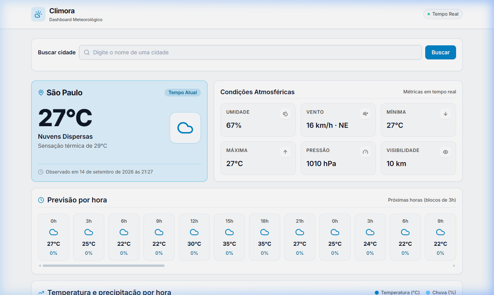
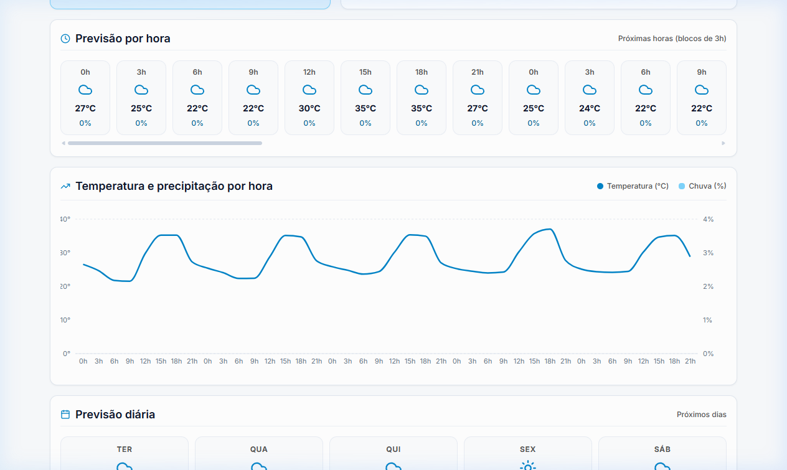
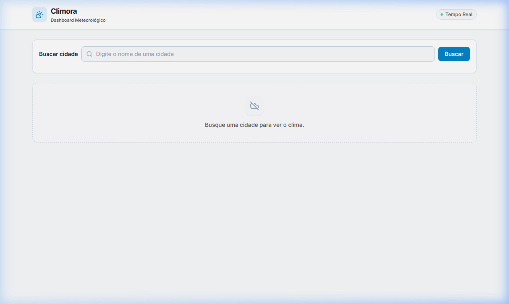
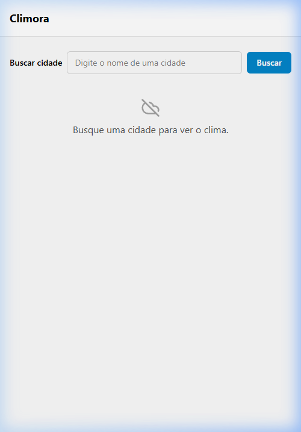
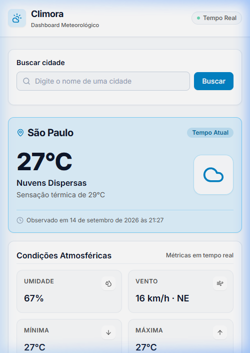
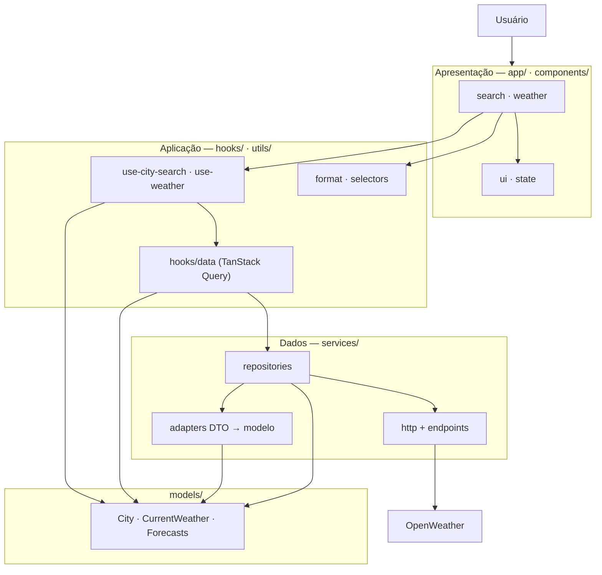

# Climora

Dashboard web de monitoramento climático, **somente frontend**, que consulta a [OpenWeather](https://openweathermap.org/api) e apresenta condições atuais, previsão e métricas em uma única tela.

O Climora foi desenvolvido como trabalho de pós-graduação. O objetivo não é cobrir meteorologia de ponta a ponta, e sim aplicar, de forma proporcional ao tamanho do sistema, separação de responsabilidades, contratos de domínio, isolamento da API externa e testes por camada — sem backend próprio.

A arquitetura foi definida **antes** da stack. As fontes de verdade continuam em [`docs/decisoes_arquiteturais.md`](docs/decisoes_arquiteturais.md) e [`docs/stack_definida.md`](docs/stack_definida.md).

---

## Demonstração

Capturas em [`docs/images/`](docs/images/). Para interagir com a aplicação, use as seções [Instalação](#instalação) e [Execução](#execução).

O fluxo ponta a ponta (busca → seleção → clima, inclusive erro com retry) também é exercitado em `tests/app/weather-flow.test.tsx`, com a rede simulada pelo MSW — sem chamada à API real.

### Dashboard





### Estado inicial





### Layout estreito



---

## Funcionalidades

- Busca de cidades por nome (geocodificação OpenWeather), com até 5 resultados, combobox WAI-ARIA e navegação por teclado (setas, Enter, Escape, Tab).
- Clima atual: temperatura, sensação térmica, condição com ícone e horário da observação (unix/UTC formatado via dayjs).
- Métricas: umidade, vento (velocidade e direção), mínima/máxima, pressão, visibilidade e precipitação **quando o dado existe** (no clima atual a OpenWeather free não fornece `pop`; o tile some nesse caso).
- Previsão por hora: blocos de 3 horas (produto gratuito da OpenWeather), com hora, condição, temperatura e precipitação.
- Previsão diária: **derivada** dos blocos de 3h (`groupHourlyByDay` em `utils/selectors`), não é um endpoint diário nativo do plano free.
- Gráfico de temperatura (°C) e precipitação (%) por hora (Recharts, carregado com `React.lazy` — chunk separado no build).
- Estados explícitos de interface: `idle`, `loading`, `success`, `empty` e `error`.
- Erros classificados (`rede`, `timeout`, `401`, `404`, `429`, `5xx`, dados inválidos, busca inválida); retry apenas para falhas transitórias (`network` / `timeout` / `server`).
- Cache em memória das consultas (cidades ~60 s, clima ~5 min), deduplicação e cancelamento da requisição ao trocar de termo ou de cidade (`AbortSignal`, ADR-06).
- Layout responsivo (grade no `DashboardLayout`) e tokens visuais no Tailwind v4; `lang="pt-BR"`.

Não há autenticação de usuário, favoritos, geolocalização do browser, tema claro/escuro, roteamento nem backend.

---

## Stack tecnológica

Versões principais conforme `package.json` (intervalo `^` / `~` onde indicado):

| Área | Tecnologia |
| --- | --- |
| UI | React 19.2, Vite 7.3, TypeScript 5.9 (strict) |
| Dados | TanStack Query 5, Axios 1 (somente em `services/http`) |
| API | OpenWeather — `geo/1.0/direct`, `data/2.5/weather`, `data/2.5/forecast` |
| Estilo | Tailwind CSS 4 (`@tailwindcss/vite`), lucide-react |
| Gráficos | Recharts 3 (lazy) |
| Datas | dayjs 1 + plugin `utc` (nunca hora local do ambiente) |
| Testes | Vitest 4, Testing Library, MSW 2, jsdom |
| Qualidade | ESLint 9 (flat), Prettier 3 |
| Pacotes | npm (`engines`: Node `>=20.19.0` ou `>=22.12.0`) |

SPA de uma página, **sem React Router**. Sem Redux/Zustand: estado de UI com `useState`; estado de servidor na camada de data-fetching.

---

## Arquitetura

Quatro preocupações funcionais e um contrato de domínio. A UI **não** importa `services/`, DTOs nem o cliente HTTP — só modelos e hooks de feature (`use-city-search`, `use-weather`).



Decisões que estruturam o código (ADRs em `docs/decisoes_arquiteturais.md`):

| ADR | Decisão |
| --- | --- |
| 01 | Pastas por tipo técnico (`app`, `components`, `hooks`, `services`…), com subpastas temáticas (`search`, `weather`). |
| 03 | Adaptação obrigatória DTO → modelo; a UI só vê o domínio. |
| 04 | Sem loja global. |
| 05 / 09 | Estados de requisição, cache e refetch na camada de data-fetching. |
| 06 | Troca de cidade/termo descarta a requisição anterior (`AbortSignal`). |
| 07 | Taxonomia única de erros (`utils/errors`). |
| 08 | Breakpoints e layout só na apresentação. |
| 10 | Repositórios são os fetchers das queries. |
| 11 | Features consomem hooks; `ui`/`state` são apresentação pura. |
| 12 | Só `services/http` lê `VITE_WEATHER_API_KEY`. |

Diagramas adicionais (fluxo de dados, componentes, sequência da busca, estados de requisição): [`docs/diagrams/`](docs/diagrams/).

---

## Pré-requisitos

- Node.js **20.19+** ou **22.12+**
- npm
- Conta e chave da OpenWeather (plano gratuito *Free Weather API*; a chave é obrigatória — o módulo HTTP falha na carga se ela estiver vazia)

O `.npmrc` do repositório define `legacy-peer-deps=true` (workaround do arborist do npm). Não remover.

---

## Instalação

```bash
git clone https://github.com/ArthurFariaPeixoto/climora.git
cd climora
npm install
```

No Windows (PowerShell), a cópia do `.env` pode ser:

```powershell
Copy-Item .env.example .env
```

Em Unix:

```bash
cp .env.example .env
```

Em seguida preencha a chave — ver a seção seguinte.

---

## Configuração das variáveis de ambiente

Arquivo local: **`.env`** (não versionado). Modelo: **`.env.example`**.

| Variável | Obrigatória | Função |
| --- | --- | --- |
| `VITE_WEATHER_API_KEY` | Sim | Chave `appid` injetada pelo interceptor Axios. Sem ela, a aplicação não sobe. |
| `VITE_WEATHER_API_BASE_URL` | Sim | URL base da API. No exemplo: `https://api.openweathermap.org` |

```env
VITE_WEATHER_API_KEY=sua_chave_aqui
VITE_WEATHER_API_BASE_URL=https://api.openweathermap.org
```

Obtenha a chave em [openweathermap.org/api](https://openweathermap.org/api). **Nunca commite `.env`.**

Há um `.env.test` **commitado**, com chave e base URL **falsas**, só para os testes MSW (`http://localhost:3003`). Não serve para rodar o app contra a API real.

Prefixo `VITE_`: o Vite embute o valor no bundle. Uma chave de API em frontend **não é segredo** após o build. Isso foi aceito de propósito (sem BFF). Mitigações: arquivo fora do Git, leitura só em `services/http`, 401 tratado como erro de configuração.

---

## Execução

Desenvolvimento (Vite; em geral `http://localhost:5173`):

```bash
npm run dev
```

Build de produção (typecheck + artefato estático em `dist/`):

```bash
npm run build
npm run preview
```

Outros scripts do `package.json`:

```bash
npm run typecheck
npm run lint
npm run lint:fix
npm run format
npm run format:check
```

O `dist/` pode ser publicado em qualquer host estático. No ambiente do host, defina `VITE_WEATHER_API_KEY` **no momento do build**. Este repositório **não** registra publicação em Vercel/Netlify/Pages — o artefato foi validado com `preview`; o passo de publicar ficou para a entrega/avaliação.

---

## Exemplos de uso

1. Suba o app (`npm run dev`) com `.env` preenchido.
2. No campo de busca, digite um nome com **pelo menos 3 letras** latinas (espaços e hífens permitidos). Termo vazio, curto ou com caracteres inválidos não dispara a API — a validação é local.
3. Submeta o formulário. A lista abre como `listbox`: use as setas, Enter para selecionar, Escape para fechar.
4. Se não houver cidades, aparece o estado vazio. Falha de rede, timeout ou 5xx mostram mensagem amigável e botão de tentar de novo; 401 pede revisão da chave; 4xx de cliente não entram em retry automático.
5. Ao escolher uma cidade, o dashboard pede clima atual + previsão (`scope: 'current+forecast'`). Enquanto carrega, há skeletons; em sucesso, os widgets preenchem a grade.
6. Role a previsão horária/diária na horizontal. O gráfico entra em um `Suspense` próprio (chunk do Recharts).

Trocar de cidade cancela a consulta anterior. Pesquisar o mesmo termo de novo, dentro do `staleTime`, reutiliza o cache.

---

## Testes

**Vitest** + **React Testing Library** + **MSW**. Nenhum teste chama a OpenWeather real (`onUnhandledRequest: 'error'`).

```bash
npm run test        # uma vez
npm run test:watch  # watch
```

O que a suíte cobre (espelho das pastas em `tests/`):

- `utils/` — validação do termo, formatadores, `groupHourlyByDay`, taxonomia de erros (`isRetryableAppError`, mensagens).
- `services/` — adapters (incluindo payload corrompido → `InvalidDataError`), classificação HTTP, `api-client` (appid, abort), repositórios com handlers MSW.
- `hooks/` — queries e fachadas (`idle` / `loading` / `success` / `empty` / `error`).
- `components/` — busca, widgets de clima, UI e estados.
- `app/` — layout, dashboard (hooks mockados) e fluxo de integração com hooks reais + MSW (`weather-flow.test.tsx`).

`src/mocks/` é **somente para testes** (fixtures, handlers, `createTestQueryClient`). Não entra em produção.

---

## Como a Inteligência Artificial Acelerou Este Projeto

A GenAI entrou como **ferramenta de apoio**: rascunho de documentos, scaffolding, implementação guiada por checklists, testes e polimento visual. As ADRs, as resoluções do anexo de inconsistências e o aceite de cada fase permaneceram **humanos**. O processo gravado no repositório é: prompt versionado → artefato → revisão contra `docs/` → checkbox no checklist só depois de `typecheck` / `lint` / `test`.

### Ferramentas utilizadas

Registradas no desenvolvimento:

| Ferramenta | Modelo | Uso principal |
| --- | --- | --- |
| **Antigravity** | **Gemini 3.8 Flash** | Design visual final e autocomplete |
| **OpenCode** | **Big Pickle** | Documentação e produção de testes |
| **Antigravity** | **Claude 4.6 Sonnet** | Validação de artefatos |
| **Cursor** | **Grok 4.6 Medium** | Documentação de entrada (`README.md`), revisão de artefatos e apoio à engenharia no IDE |

Os prompts em `prompts/` materializam as etapas (arquitetura, stack, bootstrap, `AGENTS.md` para o OpenCode, refinamento de UI). O `AGENTS.md` e os checklists em `docs/checklists/todos/` existem precisamente para o agente **não** improvisar fora do contrato.

### Desafios superados com IA

Casos que o repositório documenta — a IA acelerou a execução; o critério veio da arquitetura e do anexo-11:

- **Arquitetura sem stack, depois stack sem redesenhar a arquitetura** (`prompts/01-*`, `prompts/02-*`). Evitou o atalho “escolher React e encaixar camadas depois”.
- **Inconsistências geradas no bootstrap** (anexo-11): `daily` no bundle vs. derivação só no hook; validação de busca sem taxonomia; fail-early da chave; DTO vs. API real (`pop` ausente no clima atual). Cada item teve opção avaliada e resolução explícita — não “aceitar o código gerado”.
- **Fronteira de testes sem rede real:** adapters puros, MSW nos repositórios, hooks com `QueryClient` isolado, fluxo E2E com `React.lazy` (timeout do gráfico ajustado na fase 09).
- **Concorrência (ADR-06):** `AbortSignal` do TanStack até o Axios; abort não vira erro de UI.
- **UI apresentável sem mudar regras** (`prompts/05-melhoria-UI.md`): tokens, hierarquia e contraste, sem novas features nem loja global.
- **README de entrada:** consolidar `docs/`, prompts e código num documento único, com capturas reais e sem inflar o escopo — feito no Cursor com Grok 4.6 Medium.

### Ganhos de produtividade

Não há métricas de tempo ou percentual no projeto. O ganho observável é qualitativo:

- boilerplate alinhado às pastas da ADR-01, em vez de inventar estrutura a cada arquivo;
- documentação longa (ADRs, stack, diagramas Mermaid, checklists fase a fase) produzida a partir de prompts e depois confrontada com o código;
- suíte por camada gerada e estendida com o mesmo contrato de mocks;
- iteração visual (tokens `@theme`, variantes de `Button`/`Card`, estados) sem reabrir a arquitetura.

O que a IA **não** substituiu: decidir o que *não* entra (Redux, Next, One Call pago, BFF para esconder a chave). E ajustes manuais pelo desenvolvedor.

### Influência nas decisões de design e arquitetura

O padrão foi **IA sugeriu → humano confrontou com requisitos → decisão registrada**.

Exemplos em que a sugestão *não* vira lei só por ter sido gerada:

- camadas extras de “caso de uso” / loja global — rejeitadas (proporcionalidade, ADR-02/04);
- Open-Meteo (sem API key) — rejeitada porque o trabalho pedia exercer `.env`;
- máquina própria de request-state — substituída pelo TanStack Query *porque* a arquitetura já pedia cache, dedup e abort, não porque a biblioteca é moda;
- fail-early da chave **mantido** (anexo-11 item 3), em vez de degradar para 401 na UI.

O design visual (Gemini 3.8 Flash / Antigravity) atuou **depois** dos tokens e do catálogo de componentes já existirem: hierarquia e acabamento, não novo produto.

### Lições aprendidas

- Prompt sem arquitetura gera UI acoplada à API. Por isso a ordem foi arquitetura → stack → código, com `docs/` como contexto obrigatório.
- `AGENTS.md` + checklists reduzem deriva: o agente é instruído a marcar checkbox só após validação real.
- Código gerado precisa de testes e de uma segunda leitura. O anexo-11 existe porque o bootstrap divergiu do contrato (bundle com `daily`, DTO incompleto, etc.).
- Aceitar autocomplete em camadas erradas (Axios no componente, `any` nos adapters) quebraria as ADRs em poucas linhas.
- GenAI acelera *produção* de artefatos; engenharia é escolher fronteiras, recusar overengineering e viver com trade-offs explícitos (chave no client, daily derivado, 60 req/min da API free).

---

## Limitações

- Frontend-only: a chave OpenWeather vai no bundle.
- Plano gratuito: 60 chamadas/minuto; previsão em blocos de 3 h / 5 dias — sem daily nativo, sem One Call, sem nascer/pôr do sol por dia.
- Precipitação no card de métricas do *clima atual* pode não aparecer (a API `/weather` não expõe `pop`).
- Uma cidade por vez; sem favoritos, histórico persistente, geolocalização do dispositivo ou comparação.
- Sem publicação automática em host; deploy é o `dist/` gerado localmente.
- Testes não exercitam a API real (proposital). O smoke opcional com rede real não faz parte da suíte padrão.
- Sem arquivo de licença no repositório (`private` no `package.json`).

---

## Próximos Passos

Itens alinhados à §15 da arquitetura e ao passo 10 da stack — **não implementados**:

- [ ] Publicar o `dist/` em host estático, com `VITE_WEATHER_API_KEY` no ambiente de build
- [ ] Geolocalização do browser como origem de `lat`/`lon` (o repositório de clima já trabalha por coordenada)
- [ ] Favoritos / várias cidades (N consultas chaveadas no dashboard)
- [ ] Histórico de buscas com persistência local
- [ ] Tema claro/escuro só na apresentação
- [ ] Previsão diária mais rica, se o plano da API evoluir (campo novo em `models` + adapter)

---

## Estrutura do projeto

```text
climora/
├── docs/                  # arquitetura, stack, diagramas, checklists
├── prompts/               # prompts das etapas (arquitetura, stack, bootstrap, UI)
├── src/
│   ├── app/               # App, DashboardLayout, WeatherDashboard
│   ├── components/
│   │   ├── ui/            # Button, Card, MetricTile, Skeleton
│   │   ├── state/         # LoadingState, ErrorState, EmptyState
│   │   ├── search/        # SearchBar, SearchResults, SearchResultItem
│   │   └── weather/       # cards, previsões, gráfico, ícones
│   ├── hooks/
│   │   ├── data/          # city-query, weather-query
│   │   ├── use-city-search.ts
│   │   └── use-weather.ts
│   ├── services/
│   │   ├── http/          # Axios, chave, classificação de erro
│   │   ├── dtos/
│   │   ├── endpoints/
│   │   ├── adapters/
│   │   └── repositories/
│   ├── models/
│   ├── utils/             # format, selectors, errors, validation
│   └── mocks/             # só testes (MSW, fixtures)
├── tests/
├── .env.example
├── AGENTS.md
└── package.json
```

---

## Considerações finais

O Climora resolve um recorte deliberadamente pequeno — consultar clima de uma cidade e apresentá-lo com estados honestos — para demonstrar engenharia frontend: contrato de domínio, API isolada, data-fetching com cache e abort, e testes sem rede real.

A GenAI encurtou o caminho entre a decisão e o artefato (documentos, scaffolding, testes, UI). Não substituiu a decisão. O que permanece no repositório como critério são as ADRs, o anexo de inconsistências e a regra de ouro das fases: checkbox marcado só com a suíte verde.

---

## Documentação de referência

- [`docs/decisoes_arquiteturais.md`](docs/decisoes_arquiteturais.md) — ADRs e princípios
- [`docs/stack_definida.md`](docs/stack_definida.md) — tecnologias e justificativas
- [`docs/diagrams/`](docs/diagrams/) — Mermaid
- [`docs/checklists/todos/`](docs/checklists/todos/) — fases 00–10
- [`prompts/`](prompts/) — prompts usados nas etapas
