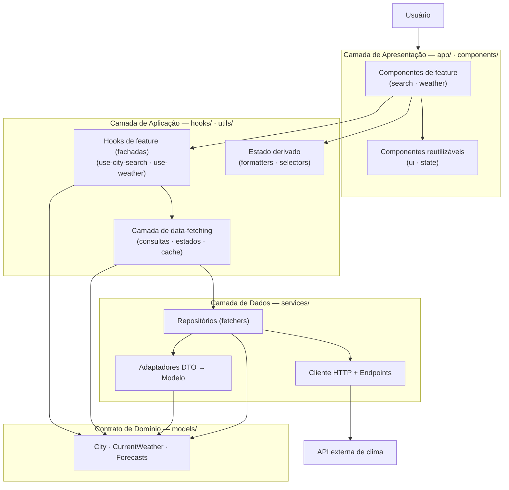
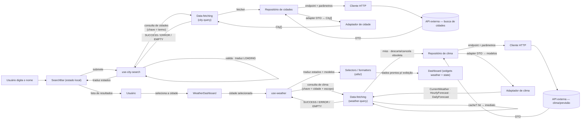
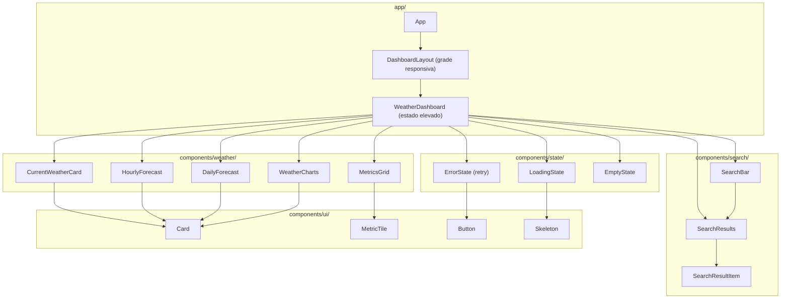
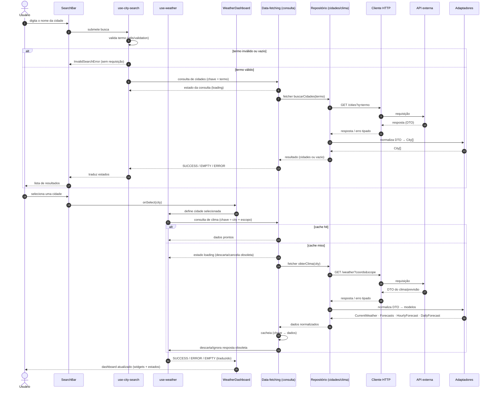
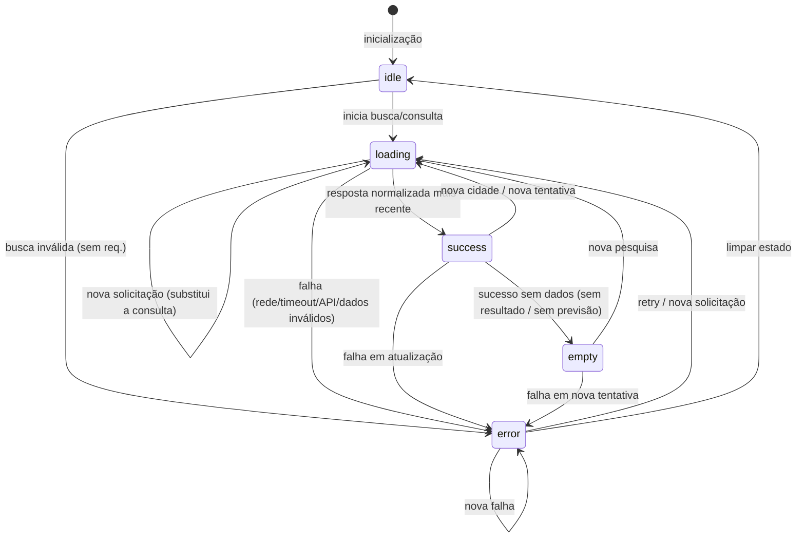

# Decisões Arquiteturais — Dashboard de Monitoramento de Clima

> **Status:** Aprovada (fase de arquitetura).
> **Escopo:** Definição da arquitetura de uma aplicação web **exclusivamente frontend** para monitoramento de clima. A definição da **stack tecnológica** (framework, linguagem, bibliotecas) é deliberadamente deixada para uma etapa posterior e **não** é resolvida neste documento.
> **Papel deste documento:** Fonte de verdade arquitetural do projeto. Registra não apenas _o que_ foi decidido, mas também _por que_ — incluindo as alternativas consideradas e descartadas.

---

## Sumário

1. [Contexto](#1-contexto)
2. [Requisitos arquiteturais](#2-requisitos-arquiteturais)
3. [Princípios orientadores](#3-princípios-orientadores)
4. [Arquitetura escolhida](#4-arquitetura-escolhida)
5. [Camadas, módulos e responsabilidades](#5-camadas-módulos-e-responsabilidades)
6. [Fluxo de dados](#6-fluxo-de-dados)
7. [Estratégia de estado](#7-estratégia-de-estado)
8. [Estratégia de integração com a API](#8-estratégia-de-integração-com-a-api)
9. [Estratégia de tratamento de erros](#9-estratégia-de-tratamento-de-erros)
10. [Estratégia de componentização](#10-estratégia-de-componentização)
11. [Estratégia de testes](#11-estratégia-de-testes)
12. [Estratégia de responsividade](#12-estratégia-de-responsividade)
13. [Considerações de performance](#13-considerações-de-performance)
14. [Considerações de segurança](#14-considerações-de-segurança)
15. [Possibilidades de evolução](#15-possibilidades-de-evolução)
16. [Decisões arquiteturais (ADRs)](#16-decisões-arquiteturais-adrs)
17. [Alternativas consideradas](#17-alternativas-consideradas)
18. [Consequências e trade-offs](#18-consequências-e-trade-offs)
19. [Diagramas Mermaid](#19-diagramas-mermaid)
20. [Decisões pendentes para a definição da stack](#20-decisões-pendentes-para-a-definição-da-stack)
21. [Validacão da arquitetura](#21-validação-da-arquitetura)

---

## 1. Contexto

O projeto é um **dashboard de monitoramento de clima** desenvolvido como trabalho de pós-graduação. Trata-se de uma aplicação web **exclusivamente frontend** que consome diretamente uma **API externa de clima** — não existe e não haverá backend próprio.

Funcionalidades esperadas:

- consultar informações climáticas de diferentes cidades;
- buscar cidades (pesquisa por nome);
- apresentar condições meteorológicas atuais (temperatura, sensação térmica, mínima, máxima, umidade, vento, condição, precipitação etc.);
- apresentar previsão por horário e por dia;
- organizar as informações em um dashboard responsivo;
- possuir componentes reutilizáveis e cobertura de testes.

O tamanho do projeto é **pequeno a médio** (uma aplicação, duas áreas de domínio: _busca de cidades_ e _clima_). A arquitetura deve ser **proporcional** a esse tamanho: simples o suficiente para ser compreensível e implementável em um curso, mas sólida o suficiente para demonstrar boas práticas (separação de responsabilidades, isolamento de integrações, testabilidade).

---

## 2. Requisitos arquiteturais

A partir dos requisitos funcionais, derivamos as **características arquiteturais** que a solução precisa atender:

| Característica               | Exigência prática                                                                                  |
| ---------------------------- | -------------------------------------------------------------------------------------------------- |
| **Testabilidade**            | Banco, financeiro, mundo real — a maior parte do sistema deve ser testável sem chamadas à API real |
| **Manutenibilidade**         | Responsabilidades claras; mudanças locais sem efeitos colaterais                                   |
| **Evolutibilidade**          | Adicionar métricas, features ou gráficos sem refatorações extensas                                 |
| **Isolamento de integração** | Nenhum componente de UI deve conhecer a estrutura de resposta da API externa                       |
| **Portabilidade de API**     | Trocar de provedor de clima não pode exigir reescrever a interface                                 |
| **Responsividade**           | Desktop, tablet e mobile; responsividade é preocupação exclusiva da apresentação                   |
| **Robustez de estados**      | Loading, erro, vazio, indisponibilidade, timeout, concorrência devem ser explícitos                |
| **Frontend puro**            | Nenhum backend; a API Key circula no navegador (limitação aceita, ver §14)                         |
| **Proporcionalidade**        | Sem camadas artificiais, sem bibliotecas de estado globais desnecessárias, sem overengineering     |

**Mapa requisito → lugar na arquitetura** (usado na validação, §21):

| Requisito funcional       | Onde é resolvido                                                          |
| ------------------------- | ------------------------------------------------------------------------- |
| Pesquisa de cidades       | `components/search/*` + `hooks/use-city-search` + camada de data-fetching + `services/repositories` |
| Clima atual / previsão    | `components/weather/*` + `hooks/use-weather` + camada de data-fetching + `services/*`               |
| Novas métricas climáticas | novo campo em `models` + novo mapeamento em `services/adapters`           |
| Componentes reutilizáveis | `components/ui/*`, `components/state/*`                                   |
| Testes                    | todas as camadas (estratégia em §11)                                      |
| Design responsivo         | `app/DashboardLayout` + `components/ui/*` (apresentação pura)             |

---

## 3. Princípios orientadores

Todas as decisões deste documento seguem estes princípios, em ordem de prioridade:

1. **Proporcionalidade** — arquitetura adequada ao tamanho do projeto, não a um sistema corporativo.
2. **Simplicidade** — preferir a solução mais simples que atende ao requisito.
3. **Baixo acoplamento** — módulos se comunicam por contratos explícitos (`models`), não por detalhes internos.
4. **Alta coesão** — cada módulo tem uma única responsabilidade clara.
5. **Separação de responsabilidades** — apresentação ≠ lógica ≠ dados.
6. **Testabilidade** — a maior parte da lógica é testável sem infraestrutura real.
7. **Evoluibilidade** — o custo de adicionar uma feature nova deve ser local, não global.

Consequência prática: **evitamos** camadas multiplicadas só por estética, abstrações antes da necessidade, dependências implícitas e componentes monolíticos. Também **evitamos** fragmentação excessiva em dezenas de componentes sem responsabilidade clara.

---

## 4. Arquitetura escolhida

A arquitetura combina duas decisões ortogonais:

### 4.1 Separação funcional em camadas conceituais

O projeto é dividido em **quatro camadas funcionais** mais um **contrato de domínio**. Não são camadas que se empilham obrigatoriamente — são _preocupações_ que definem o que cada arquivo pode fazer:

```
┌─────────────────────────────────────────────────────────┐
│ Apresentação (UI)   — app/ · components/                │
│   só renderiza estado; não conhece API, não busca dados  │
├─────────────────────────────────────────────────────────┤
│ Aplicação / Lógica   — hooks/ · utils/                  │
│   orquestra consultas, valida, traduz estado, deriva,    │
│   formata                                                │
├─────────────────────────────────────────────────────────┤
│ Data-fetching   — camada de data-fetching               │
│   consultas chaveadas, estados de requisição, cache,     │
│   deduplicação, invalidação, refetch, cancelamento       │
├─────────────────────────────────────────────────────────┤
│ Acesso a dados   — services/                            │
│   HTTP, endpoints, adapters, repositories; única camada  │
│   que conhece a API externa                              │
├─────────────────────────────────────────────────────────┤
│ Contrato de domínio — models/                           │
│   tipos de domínio compartilhados por todas as camadas   │
└─────────────────────────────────────────────────────────┘
```

**Regra de dependência:** `models` não depende de ninguém. `services` depende de `models` (e das DTOs). A camada de data-fetching depende de `models`, das assinaturas dos repositórios e do transporte HTTP. `hooks`/`utils` dependem de `models`, da camada de data-fetching e podem usar `services` via repositórios. `components` dependem de `models` e das assinaturas dos `hooks` — **nunca** de DTOs, da camada de data-fetching nem do cliente HTTP.

### 4.2 Organização de diretórios por tipo técnico

O projeto é organizado **primariamente por tipo técnico**, com um **desdobramento temático secundário** dentro de `components/`, `hooks/` e `services/` para preservar coesão (ver justificativa na ADR-01). Estrutura-alvo:

```
climora/
└── src/
    ├── app/                        # composição raiz (página / dashboard)
    │   ├── App                     # ponto de entrada visual
    │   ├── DashboardLayout         # responsividade em grade (breakpoints)
    │   └── WeatherDashboard        # composição de widgets + estado elevado
    │
    ├── components/                 # apresentação pura; recebe props/hooks
    │   ├── ui/                     # genéricos reutilizáveis
    │   │   ├── Card
    │   │   ├── MetricTile
    │   │   ├── Button
    │   │   └── Skeleton
    │   ├── state/                  # estados da interface
    │   │   ├── LoadingState
    │   │   ├── ErrorState
    │   │   └── EmptyState
    │   ├── search/                 # feature: busca de cidades
    │   │   ├── SearchBar
    │   │   ├── SearchResults
    │   │   └── SearchResultItem
    │   └── weather/                # feature: clima do dashboard
    │       ├── CurrentWeatherCard
    │       ├── MetricsGrid
    │       ├── HourlyForecast
    │       ├── DailyForecast
    │       └── WeatherCharts
    │
    ├── hooks/                      # lógica de aplicação (fachadas sobre data-fetching)
    │   ├── data/                   # camada de data-fetching (consultas chaveadas)
    │   │   ├── city-query          # consulta de busca de cidades (chave = termo)
    │   │   └── weather-query       # consulta de clima (chave = cidade + escopo)
    │   ├── use-city-search         # fachada fina: traduz consulta → estados + City[]
    │   └── use-weather             # fachada fina: traduz consulta → modelos + estados
    │
    ├── services/                   # acesso a dados — conhece a API externa
    │   ├── http/                   # cliente HTTP, config, timeout, erros de rede
    │   ├── dtos/                   # contratos de resposta da API (DTOs)
    │   ├── endpoints/              # rotas e construção de parâmetros
    │   ├── adapters/               # normalização DTO → modelo
    │   └── repositories/           # fetchers: orquestram client + endpoints + adapters
    │
    ├── models/                     # contrato interno de domínio
    │   ├── City
    │   ├── CurrentWeather
    │   ├── HourlyForecast
    │   ├── DailyForecast
    │   └── WeatherRequest
    │
    ├── utils/                      # funções puras (testáveis sem mock)
    │   ├── format/                 # temperatura, vento, data/hora, unidades
    │   ├── selectors/              # derivação: agrupar por dia, métricas
    │   ├── errors/                 # taxonomia de erros da aplicação
    │   └── validation/             # validação de busca (vazia, inválida)
    │
    └── mocks/                      # fixtures de DTOs e modelos para testes
```

> **Nomenclatura neutra de stack:** arquivos são nomeados sem extensão de linguagem. A decisão JavaScript vs TypeScript pertence à etapa de stack.

---

## 5. Camadas, módulos e responsabilidades

### 5.1 `app/` — Composição

Onde o dashboard é montado.

- `App` — ponto de entrada; carrega configuração, renderiza `DashboardLayout`.
- `DashboardLayout` — define a grade responsiva e a disposição dos blocos por tamanho de tela. **Única camada que decide layout.**
- `WeatherDashboard` — **composição raiz**. Mantém a cidade selecionada, consome `use-weather` e distribui os dados (e estados) para os widgets filhos. Não contém lógica de negócio nem conhece a API.

### 5.2 `components/` — Apresentação

Componentes **puros e direcionados por dados**: recebem dados formatados e callbacks por props (ou colapsam hooks de feature). Regeram conforme o estado recebido.

- `ui/` — genéricos reutilizáveis (Card, MetricTile, Button, Skeleton). **Sem estado externo.**
- `state/` — `LoadingState`, `ErrorState` (com ação de "tentar novamente"), `EmptyState`. Consomem a taxonomia de erros para exibir mensagens amigáveis.
- `search/` — widgets da busca de cidades.
- `weather/` — widgets do clima (atual, métricas, previsões, gráficos).

Regra de ouro: **nenhum componente importa `services/` diretamente.** A comunicação é feita pelos `hooks`.

### 5.3 `hooks/` — Lógica de aplicação

É o ponto de conexão entre UI e dados: os hooks de feature são **fachadas finas** que traduzem o resultado das consultas (camada de data-fetching) em estados de apresentação e modelos. Não contêm máquina de estados nem cache próprios — essas responsabilidades pertencem à camada de data-fetching (§5.3a).

- `use-city-search` — envolve a consulta de cidades; expõe termo, validação, estados e resultados (`City[]`) para a barra de busca.
- `use-weather` — envolve a consulta de clima; recebe uma cidade selecionada, conduz o refetch/cancelamento via camada de data-fetching e expõe `CurrentWeather`, `HourlyForecast`, `DailyForecast` + estados.

Ambos traduzem o estado da consulta para a taxonomia canônica (`idle | loading | success | error | empty`), tornando `empty` explícito quando a consulta responde `success` sem dados.

### 5.3a Camada de data-fetching

Camada que orquestra **acesso a dados remoto de forma declarativa**, sem conhecer a API externa. Centraliza os mecanismos que antes seriam manuais:

- **Consultas chaveadas** — cada consulta é identificada por uma chave (termo de busca; cidade + escopo de dados), permitindo reuso, invalidação e deduplicação.
- **Estados de requisição** — `pending/loading`, `success`, `error` expostos uniformemente, com preservação da última resposta válida durante atualizações em segundo plano.
- **Cache em memória** — por chave de consulta, com TTL/freshness configurável e invalidação quando a cidade muda.
- **Deduplicação em voo** — duas consultas simultâneas para a mesma chave compartilham a mesma promessa.
- **Remoção de respostas obsoletas** — ao trocar de cidade/termo, a resposta da consulta antiga é descartada ou a requisição é cancelada via sinal de abort no transporte.
- **Refetch e invalidação** — nova consulta "tentar novamente" (retry) e atualização em segundo plano sem apagar os dados atuais.

Onde vive: `hooks/data/` (as consultas `city-query` e `weather-query`). Seus *fetchers* são os métodos dos repositórios (§5.4). A UI e os componentes de feature **não consomem a camada de data-fetching diretamente** — sempre via hooks de feature (§5.3).

### 5.4 `services/` — Acesso a dados

**Única camada que conhece a API externa.** Isola HTTP, endpoints, DTOs e normalização.

- `http/` — cliente HTTP: base URL, timeout, injeção da API Key, cancelamento por sinal, classificação de erros de transporte (rede, timeout, HTTP status).
- `dtos/` — tipos que espelham a resposta da API externa (contrato externo explícito).
- `endpoints/` — rotas e construtores de parâmetros (ex.: busca de cidade, clima atual, previsão por hora/dia). Centraliza onde a estrutura da API vive.
- `adapters/` — funções puras que transformam **DTO → modelo interno**. Location: `services/adapters`.
- `repositories/` — **fetchers de dados**: `searchCities(termo)` e `getWeather(cidade)` orquestram client + endpoint + adapter e retornam dados já normalizados. São as funções executadas pelas consultas da camada de data-fetching. A interface exposta usa **apenas `models`**.

### 5.5 `models/` — Contrato de domínio

Tipos que representam o domínio **da forma como a aplicação o entende**, independente da API: `City`, `CurrentWeather`, `HourlyForecast`, `DailyForecast`, unidades, datas. É a "linguagem" compartilhada entre serviços, hooks e componentes. Se a API mudar, só `dtos/` + `adapters/` mudam.

### 5.6 `utils/` — Funções puras

Sem efeitos colaterais, sem dependência de UI ou rede. Têm a maior densidade de testes unitários:

- `format/` — formatar temperatura, velocidade/direção do vento, data/hora, umidade;
- `selectors/` — derivar dados para exibição (agrupar previsão por dia, calcular métricas agregadas);
- `errors/` — taxonomia de erros da aplicação e mensagens amigáveis;
- `validation/` — validar busca (vazia, muito curta, caracteres inválidos).

### 5.7 `mocks/` — Fixtures de teste

Dados de exemplo (DTOs e modelos), _handlers_ de API falsos e a **camada de data-fetching de teste** (provedor controlado em memória). **Usados apenas em testes**, nunca em produção. Local onde o "mundo exterior" é simulado (ver §11).

---

## 6. Fluxo de dados

O fluxo central tem duas fases encadeadas: **(A) busca da cidade** e **(B) carregamento do clima**.

```
Fase A — Busca
Usuário digita → SearchBar → use-city-search → consulta de cidades (data-fetching) →
  Repositório (cities) → endpoint de busca → API → DTO → adapter → City[] → hook → SearchResults

Fase B — Clima
Usuário seleciona cidade → WeatherDashboard → use-weather → consulta de clima (data-fetching) →
  Repositório (weather) → endpoint de clima → API → DTO → adapter → modelos → hook (estado) →
  selectors/formatters → CurrentWeatherCard · MetricsGrid · HourlyForecast · DailyForecast · WeatherCharts
```

Pontos decisivos do fluxo:

- **Onde vive o estado da pesquisa:** o _termo digitado_ é estado local do `SearchBar` (UI); a _lista de resultados_ é estado da consulta de cidades (traduzida pelo `use-city-search`); a _cidade selecionada_ é elevada ao `WeatherDashboard` (o elo entre as fases A e B).
- **Onde vivem os dados meteorológicos:** no resultado da consulta de clima (cache da camada de data-fetching), traduzido pelo `use-weather`, na composição raiz. Não há loja global (§7).
- **Cache:** a camada de data-fetching impede requisições repetidas para a mesma chave (cidade + escopo de dados). A UI não conhece o cache — é detalhe da camada, invisível para hooks e componentes.
- **Substituição de cidade:** selecionar uma cidade nova altera a chave da consulta de clima no `use-weather`; a consulta vai para `loading` e a cidade antiga é substituída pela resposta válida mais recente.
- **Concorrência:** a camada de data-fetching descarta a resposta da consulta obsoleta (ou a cancela via sinal de abort no transporte) — somente a resposta mais recente transita para `success`. Requisições em voo para a mesma chave são deduplicadas na camada.
- **Dados temporários:** durante o `loading`, o dashboard pode exibir um esqueleto (skeleton) sem descartar os dados anteriores; a camada de data-fetching permite "mostrar dados anteriores com indicador de atualização em segundo plano" como refinamento futuro.

O diagrama D-4 (sequência) detalha esse fluxo, e o D-2 ilustra o pipeline completo.

---

## 7. Estratégia de estado

A aplicação distingue quatro tipos de estado. A camada de data-fetching gerencia o estado de requisição e o cache; o restante é **elevação de estado + hooks locais**. **Não** há solução global de gerenciamento de estado (ver ADR-08).

| Tipo                     | Exemplos                                                                                                       | Onde vive                                                                                             |
| ------------------------ | -------------------------------------------------------------------------------------------------------------- | ----------------------------------------------------------------------------------------------------- |
| **Estado de UI**         | valor do campo de busca, dropdown aberto, seleção de aba, tooltip                                              | estado local nos componentes (`components/search`, `components/ui`)                                   |
| **Estado de dados**      | cidade selecionada; clima atual; previsões                                                                     | `WeatherDashboard` (cidade) + resultado da consulta traduzido pelos hooks (`use-weather`, `use-city-search`) |
| **Estado de requisição** | `idle \| loading \| success \| error` (+ `empty` para sucesso sem dados)                                       | camada de data-fetching (por chave de consulta); traduzido pelos hooks de feature                     |
| **Estado derivado**      | valores formatados, previsão agrupada por dia, métricas calculadas, direção do vento em texto, condition→ícone | funções puras em `utils/format` e `utils/selectors`, invocadas no nível dos componentes/hooks         |

**Estados de requisição** expostos pela camada de data-fetching (ver D-5):

```
INITIAL(idle) → LOADING → SUCCESS   (fluxo principal)
LOADING      → ERROR                (falha: rede, timeout, API, dados inválidos)
SUCCESS      → EMPTY                (cidade sem previsão, busca sem resultado)
SUCCESS/ERROR → LOADING             (nova cidade, nova tentativa, retry)
```

Os estados são **uniformizados pela camada de data-fetching** e traduzidos por `use-city-search` e `use-weather` — uniformidade que torna os estados da interface previsíveis e baratos de testar (a camada é simulável; a tradução é testada com a camada simulada).

**Derivação de dados:** estado derivado nunca é mutado e nunca é armazenado além do necessário — é sempre calculado por funções puras a partir do estado de dados. Isso elimina fontes de inconsistência (ex.: formato do vento não pode divergir da umidade porque ambos derivam do mesmo modelo).

---

## 8. Estratégia de integração com a API

### 8.1 Decisões centrais

| Questão                            | Resposta                                                                                         |
| ---------------------------------- | ------------------------------------------------------------------------------------------------ |
| Onde fica a comunicação HTTP       | `services/http/` (cliente, timeout, erros de transporte)                                         |
| Onde fica o cliente da API         | `services/http/` (única configuração de transporte, chave, base URL)                             |
| Onde ficam os endpoints            | `services/endpoints/` (rotas + parâmetros centralizados)                                         |
| Como os parâmetros são construídos | funções puras por endpoint (ex.: `buildSearchQuery(termo)`, `buildWeatherQuery(cidade, escopo)`) |
| Como as respostas são tratadas     | recebidas tipadas como DTO (`services/dtos`), validadas, normalizadas                            |
| Onde ocorre a transformação        | `services/adapters/` (funções puras DTO → modelo)                                                |
| Como os erros são propagados       | erros tipados pela taxonomia (§9), do `http/` → repositório → camada de data-fetching → hook → UI |
| Como o frontend consome            | hooks de feature consomem consultas da camada de data-fetching, que executam repositórios; a UI vê apenas `models` + estados |
| Como separar externo de interno    | contratos externos em `dtos/`; contrato interno em `models/`; ponte em `adapters/`               |

### 8.2 Por que existir uma camada de adaptação

Sim, a camada de adaptação é **adequada e necessária** neste projeto, e é o coração da arquitetura:

- Um componente de clima **não deve depender** do shape específico de nenhuma API externa (ex.: um provedor pode entregar `wind.speed`, outro `wind_kph`, outro `Wind/SpeedKm`).
- A feature exibe **do que a aplicação precisa**, não do que a API entrega em formato bruto.
- Trocar de provedor (ou adicionar um segundo) deve significar alterar **apenas** `dtos`, `adapters` e possivelmente `endpoints` — a UI permanece intocada.
- Adapters são funções puras: testáveis sem rede, o que atende o requisito de testabilidade diretamente.

```
API externa
    ↓
DTO (services/dtos)          ← contrato do mundo externo
    ↓
Adapter (services/adapters)  ← normalização (funções puras)
    ↓
Modelo (models)              ← contrato da aplicação
    ↓
Camada de data-fetching      ← consulta/cache/estados (fetchers = repositories)
    ↓
hooks → components           ← a UI só conhece o modelo
```

### 8.3 Duas áreas funcionais da API

O provedor será escolhido na etapa de stack, mas arquitetonicamente prevemos duas áreas:

1. **Geocodificação / busca de cidades** — termo → lista de cidades (`City[]`).
2. **Clima** — dados atuais + previsão por hora/dia para uma cidade. _Escopo de dados_ (atual + horas + dias) é um parâmetro do repositório, permitindo reduzir requisições futuramente.

Cada área tem seu repositório (ou métodos no repositório de clima) — `services/repositories` — expondo fetchers coesos que alimentam as consultas da camada de data-fetching (uma por área), consumidas pelos hooks de feature.

---

## 9. Estratégia de tratamento de erros

Os erros são **cidadãos de primeira classe** da arquitetura, não exceções esquecidas. Eles são classificados em `utils/errors` e produzidos na origem (transporte/HTTP/mapping), propagando tipados até a UI.

### 9.1 Taxonomia de erros

| Erro                 | Origem                                                    | Ação típica na UI                                            |
| -------------------- | --------------------------------------------------------- | ------------------------------------------------------------ |
| `InvalidSearchError` | busca vazia ou inválida (validação em `utils/validation`) | mensagem no campo; não dispara requisição                    |
| `NetworkError`       | falha de rede (conexão perdida)                           | `ErrorState` com "tentar novamente"                          |
| `TimeoutError`       | `services/http` (limite de tempo)                         | `ErrorState` dedicado                                        |
| `NotFoundError`      | API responde 404 (cidade inexistente)                     | `EmptyState` / mensagem de cidade não encontrada             |
| `UnauthorizedError`  | chave inválida/expirada (401)                             | mensagem de configuração; não é tratado como caso de negócio |
| `ServerError`        | 5xx / indisponibilidade da API                            | `ErrorState` com retry e texto de indisponibilidade          |
| `InvalidDataError`   | resposta corrompida/DTO inválido no adapter               | `ErrorState` de dados incompletos                            |
| `EmptyDataState`     | sucesso sem dados (cidade sem previsão)                   | `EmptyState` informativo                                     |

### 9.2 Onde cada erro é tratado

- **Detecção e tipificação:** `services/http` (transporte/status) e `services/adapters` (mapping). A API externa nunca vaza details crus para a UI.
- **Consolidação de requisição:** a camada de data-fetching consolida o erro no estado da consulta (`error`), preservando a última resposta válida quando aplicável; os hooks de feature traduzem o erro para a taxonomia de apresentação.
- **Apresentação:** `components/state/ErrorState` e `EmptyState` leem a taxonomia e escolhem a mensagem + ação (retry). Um mapa erro → mensagem/ícone vive em `utils/errors`.

A ausência de dados em um widget específico (ex.: uma cidade sem previsão horária) não derruba o dashboard inteiro: cada widget de `components/weather/*` é capaz de renderizar seu próprio `EmptyState`/fallback, porque recebe dados opcionais e os estados de requisição do `use-weather`.

---

## 10. Estratégia de componentização

### 10.1 Princípios

- **Alta coesão, baixo acoplamento:** cada componente tem uma responsabilidade; componentes falam entre si só por props/imersão de conteúdo.
- **Sem monolito:** `WeatherDashboard` é composição, não "tudo em um".
- **Sem fragmentação excessiva:** evitamos dividir o que não divide responsabilidade. A lista-alvo abaixo (~15 componentes) é deliberada.
- **Componentes de UI puras:** `components/ui/*` não conhecem domínio, nem API, nem estado global — máxima reutilização.
- **Componentes de feature:** colapsam os hooks de feature (ex.: `SearchBar` usa `use-city-search`; widgets `weather/*` recebem dados do `use-weather`). Eles são a _única_ ponte entre apresentação e lógica.

### 10.2 Catálogo

| Grupo                     | Componentes                                                                             | Regra                                                     |
| ------------------------- | --------------------------------------------------------------------------------------- | --------------------------------------------------------- |
| **Globais/reutilizáveis** | `Card`, `MetricTile`, `Button`, `Skeleton`                                              | puros, sem estado externo                                 |
| **Estados da interface**  | `LoadingState`, `ErrorState`, `EmptyState`                                              | recebem erro taxonômico / mensagem                        |
| **Feature busca**         | `SearchBar`, `SearchResults`, `SearchResultItem`                                        | usam `use-city-search`                                    |
| **Feature clima**         | `CurrentWeatherCard`, `MetricsGrid`, `HourlyForecast`, `DailyForecast`, `WeatherCharts` | recebem `models` formatados do `use-weather`              |
| **Composição**            | `App`, `DashboardLayout`, `WeatherDashboard`                                            | montam o todo; `WeatherDashboard` segura o estado elevado |

### 10.3 Relações-chave (ver D-3)

- `WeatherDashboard` → orquestra widgets e compõe os componentes de estado;
- widgets `weather/*` → consomem `components/ui/*` (Card, MetricTile) e `utils/selectors` para exibição;
- `SearchBar` e `SearchResults` juntos formam o fluxo de busca; a seleção flui para `WeatherDashboard`.

---

## 11. Estratégia de testes

A biblioteca de testes será definida na etapa de stack. Aqui definimos **o que** testar, **onde** e **como** cada camada é isolada do mundo real.

### 11.1 Mapa de testes por camada

| Camada                                                       | O que testar                                                                    | Independência da API real                                    |
| ------------------------------------------------------------ | ------------------------------------------------------------------------------- | ------------------------------------------------------------ |
| `utils/` (formatters, selectors, validation, errors)         | regras de formatação, derivação, validação, mensagens                           | **total** — funções puras, sem mock                          |
| `services/adapters`                                          | DTO → modelo (campos, unidades, casos corrompidos)                              | **total** — entradas = fixtures de `mocks/`                  |
| `services/repositories`                                      | orquestração client→adapter, normalização e erros                               | **mock do cliente HTTP** — respostas controladas em `mocks/` |
| `services/http`                                              | classificação de erros, timeout, cabeçalhos (chave), cancelamento por sinal     | **mock do transporte/substituição de fetch**                 |
| camada de data-fetching (`city-query`, `weather-query`)      | chave de consulta, cache/hit-miss, dedup em voo, invalidação, refetch, estados  | **repositórios mockados** — cache e estados controlados      |
| `hooks/` (`use-city-search`, `use-weather`)                  | tradução de estados (loading/success/error/empty), argumentos da consulta       | **camada de data-fetching simulada** — cada estado induzido  |
| `components/ui`                                              | renderização por props, variantes                                               | **total** — props diretas                                    |
| `components/state`                                           | Loading/Error/Empty para cada tipo de erro                                      | **total/parciais** — props diretas                           |
| `components/search` e `components/weather`                   | estados: loading, success, error, empty; interação (digitar, selecionar, retry) | **hooks mockados** — cada estado simulado com fixtures       |
| `app/WeatherDashboard`                                       | composição, vínculo busca → seleção → clima                                     | **hooks mockados**                                           |

### 11.2 Onde vivem os mocks (conceitualmente)

- `mocks/` — fixtures de DTOs e modelos (dados de exemplo por estado), _handlers_ de API simulada e uma **camada de data-fetching de teste** (mecanismo com a camada real substituído por um provedor controlado em memória).
- **A fronteira de mocks preferida é a camada de data-fetching:** hooks e componentes testam contra as consultas simuladas, sem rede e com cache/estados controlados. Os casos de cache/dedup/invalidação da própria camada são testados com repositórios mockados. Isso segue:

```
UI → hooks → Camada de data-fetching simulada → (sem rede)
                └→ Mock de repositório (ao testar a camada)
                        └→ Mock de HTTP (ao testar repositories)
```

- Testes de integração leve (opcional, sem marcar como obrigatório) poderiam exercitar `http + endpoints + adapter` contra um mock no nível do transporte, garantindo que os contratos DTO batem.

### 11.3 Regras

- Testar **Estados, não só "o caminho feliz"**: success, loading, error, empty, concorrência (busca nova enquanto antiga em voo).
- Componentes de feature recebem dados já formatados; portanto os testes de UI não precisam montar modelos complexos — basta prover props/fixtures pequenas.
- Nenhum teste (a não ser um teste de smoke opcional, explicitamente marcado) depende de chamada real à API externa.

---

## 12. Estratégia de responsividade

A responsividade é **responsabilidade exclusiva da camada de apresentação**.

- `app/DashboardLayout` define a **grade responsiva**: uma, duas ou múltiplas colunas conforme o breakpoint. A decisão de _quantas colunas e qual ordem_ vive somente aqui.
- Widgets (`CurrentWeatherCard`, `Forecast`, gráficos) são **fluidos**: ocupam o espaço dado pelo grid, sem conhecer o tamanho da tela.
- Quebras de layout são declaradas em termos de _classes de tamanho_ (pequeno/médio/grande), abstração mantida na camada de UI — nunca importada por `services`, `hooks` ou `models`.
- Estados de interface (Loading/Error/Empty) são desenhados para qualquer largura; sem lógica condicional de breakpoint fora dos componentes.

Isso garante que nenhuma regra de negócio seja "empurrada" por um requisito de layout e vice-versa: uma change de responsividade toca apenas `DashboardLayout` e folhas de estilo.

---

## 13. Considerações de performance

Sem otimizações prematuras — decisões arquiteturais abaixo apenas **estabelecem pontos de controle** para evitar problemas comuns:

- **Cache em memória** (camada de data-fetching): consultar a mesma cidade duas vezes não gera segunda requisição. Chave = escopo da consulta (cidade + tipo de dados). TTL/freshness configuráveis.
- **Deduplicação de requisições em voo:** duas tentativas simultâneas para a mesma chave compartilham a mesma promessa (camada de data-fetching).
- **Controle de concorrência na camada de data-fetching:** respostas obsoletas são descartadas (ou as requisições canceladas via sinal de abort) — evita "última resposta aleatória" ao trocar cidades rapidamente.
- **Estado derivado puro + componentes pequenos:** menos renderizações desnecessárias; cada widget rerenderiza apenas com os dados que lhe pertencem.
- **Gráficos isolados:** `WeatherCharts` é um bloco autocontido; permite **lazy-loading / code splitting** quando a stack for definida, mantendo o restante leve.
- **Escopo de dados configurável no repositório:** futuro destino de buscar só "hoje" ou "hoje + semana" mantém a resposta mínima.
- **Poucas requisições por natureza:** uma busca de cidade + uma consulta de clima por seleção. Sem polling, sem carência de dados, sem redundância.

Nada disso é implementado agora; a arquitetura apenas garante que os pontos de controle existem (repositório único de acesso como fetcher, cache/estados/concorrência na camada de data-fetching, hooks como fachadas).

---

## 14. Considerações de segurança

A API externa autentica por **API Key**, e a aplicação é **exclusivamente frontend**. Implicação arquitetural, registrada aqui:

> Uma API Key enviada a partir do navegador **não é um segredo absoluto**: o cliente precisa da chave para montar a requisição, e qualquer pessoa com acesso ao bundle do frontend pode extraí-la. Qualquer mitigação que esconda a chave de verdade (proxy/BFF) exigiria um backend, o que é **fora do escopo** deste projeto.

Consequências aceitas:

1. A chave será injetada pelo ambiente (variável de ambiente definida na etapa de stack) e **nunca** gravada no repositório nem em logs.
2. A factibilidade de proteção real depende das políticas do provedor (restrições de domínio/host de referer permitidos, limites de taxa, rotação).
3. Nenhuma arquitetura interna tenta "esconder" a chave — isso seria segurança por obscuridade; documentamos a limitação para a banca/avaliação.
4. Boas práticas que **não dependem de stack**: não logar payloads de resposta com chave; usar HTTPS; tratar 401 como erro de configuração e não como caso de negócio.

Isso não bloqueia a arquitetura: a injeção da chave fica concentrada em `services/http`, única configuração de transporte.

---

## 15. Possibilidades de evolução

A arquitetura foi desenhada para que cada evolução seja **local**, sem refatorações estruturais:

| Feature futura                     | Como se encaixa                                                                                                                 |
| ---------------------------------- | ------------------------------------------------------------------------------------------------------------------------------- |
| Múltiplas cidades favoritas        | novo hook (`use-favorites`) + persistência local; `WeatherDashboard` passa a renderizar N instâncias da consulta de clima (chave por cidade) |
| Histórico de pesquisas             | extensão de `use-city-search` + persistência local; Item do histórico reusa consultas já cacheadas                             |
| Previsão estendida                 | novo campo em `DailyForecast` + novo mapeamento no adapter — UI ganha uma coluna                                                |
| Gráficos/qualidade do ar/alertas   | novos "cards de métrica" reutilizando `Card`/`MetricTile`; novo bloco `WeatherCharts` já previsto para lazy-load                |
| Geolocalização / localização atual | geolocalização vira uma _origem_ de coordenadas no `use-weather` (buscar por lat/lon, que o repositório já suporta em `models`) |
| Comparação entre cidades           | `WeatherDashboard` segura N cidades em vez de 1, com N consultas chaveadas; componentes individuais já são puros e reaproveitáveis |
| Temas claro/escuro                 | decisão de classe/atributo na camada de apresentação; nenhuma alteração em lógica ou dados                                      |

**Padrão geral de extensão:** adicionar métrica = `models` + `adapters` + um `MetricTile`. Adicionar feature = uma pasta em `components/`, um hook de feature, um fetcher de repositório e sua consulta na camada de data-fetching. Nada exige reescrever camadas existentes.

---

## 16. Decisões arquiteturais (ADRs)

### ADR-01 — Organização do projeto por tipo técnico (com desdobramento temático)

- **Decisão:** organizar os diretórios primariamente por tipo técnico (`app`, `components`, `hooks`, `services`, `utils`, `models`, `mocks`), com subpastas temáticas dentro de `components/`, `hooks/` e `services/`.
- **Contexto:** projeto pequeno-médio, duas áreas de domínio, um desenvolvedor, ciclo acadêmico curto.
- **Alternativas consideradas:** (a) feature-based pura (`features/weather`, `features/city-search`); (b) híbrida (feature + core compartilhado); (c) tipo técnico puro sem subpastas temáticas.
- **Escolha:** tipo técnico como chave primária, com desdobramento por feature nas pastas que crescem (`components/search`, `components/weather`, `services/...`, `hooks/data/`).
- **Justificativa:** em um projeto pequeno, a navegação por tipo é a mais familiar e a menor coisa que funciona; as subpastas temáticas recuperam a coesão que o tipo técnico puro perde, sem introduzir o custo cognitivo de uma taxonomia por feature no topo.
- **Consequências:** dependências entre domínios são menos evidentes que no model por feature; mitigamos com o contrato `models` e com a regra de dependência da §4.1. Se o projeto crescer além do esperado, a evolução natural é migrar para feature-based — os módulos já são coesos, então a migração é mecanográfica.

### ADR-02 — Camadas funcionais proporcionais, sem camadas artificiais

- **Decisão:** separar apenas apresentação / lógica de aplicação / data-fetching / acesso a dados, mais um contrato de domínio (`models`).
- **Contexto:** arquiteturas mais estratificadas (casos de uso, gateways, etc.) seriam overengineering aqui.
- **Alternativas consideradas:** (a) camadas adicionais de "casos de uso"/"aplicação dedicada"; (b) single-file (tudo no componente); (c) separação mínima escolhida.
- **Escolha:** separação mínima descrita na §4.
- **Justificativa:** a complexidade inerente do projeto cabe em 4 preocupações; cada uma é testável; a regra de dependência impede acoplamento à API.
- **Consequências:** simples de entender; o preço é que há menos espaço para crescer antes de reorganizar — aceitável pelo escopo.

### ADR-03 — Camada de adaptação obrigatória (DTO → modelo)

- **Decisão:** toda resposta da API passa por `services/adapters` antes de chegar ao domínio; a UI só consome `models`.
- **Contexto:** requisito explícito de que componentes não conheçam o shape da API; possibilidade de trocar de provedor.
- **Alternativas consideradas:** (a) usar DTOs diretamente nos componentes; (b) adaptação condicional/parcial.
- **Escolha:** normalização integral e obrigatória.
- **Justificativa:** protege a UI de mudanças externas e torna a transformação em função pura testável — dois requisitos centrais.
- **Consequências:** um arquivo a mais por recurso (`adapters`); em troca, a troca de provedor vira um trabalho local de baixo custo.

### ADR-04 — Estado sem biblioteca global (dado do servidor via data-fetching)

- **Decisão:** não introduzir loja/estado global; usar elevação de estado + hooks locais para estado de UI/dados, delegando o **dado do servidor** (estado de requisição, cache, invalidação) à camada de data-fetching.
- **Contexto:** o dado compartilhado (cidade selecionada + clima) flui em uma única direção, numa árvore rasa.
- **Alternativas consideradas:** (a) biblioteca de gerenciamento de estado global; (b) contexto/estado global; (c) elevação de estado + camada de data-fetching.
- **Escolha:** elevação simples em `WeatherDashboard` + data-fetching para estado de servidor.
- **Justificativa:** não há necessidade de sincronização entre árvores distantes; introduzir loja global seria custo sem retorno, e a camada de data-fetching já cobre cache/estados. (Se a stack daqui a X evoluir para comparação/favoritos, ainda assim N consultas/instâncias locais bastam.)
- **Consequências:** menos código de infraestrutura; a fronteira é clara — estado de UI/dados local, estado de servidor na camada de data-fetching.

### ADR-05 — Estados de requisição delegados à camada de data-fetching

- **Decisão:** adotar uma solução de data-fetching cuja camada própria centraliza os estados de requisição (`idle | loading | success | error`, com `empty` derivado na apresentação), o cache, a deduplicação e o refetch; **elimina-se a máquina própria** (`request-state`).
- **Contexto:** requisito de que loading/erro/vazio/concorrência sejam tratados arquiteturalmente, não como exceção; construir e manter a máquina manual não agrega valor a um projeto deste porte.
- **Alternativas consideradas:** (a) estados ad-hoc por hook; (b) máquina própria mínima; (c) solução de data-fetching adotada.
- **Escolha:** solução de data-fetching, com hooks de feature como fachadas de tradução.
- **Justificativa:** uniformiza estados, dedup, cache e invalidação num mecanismo maduro e testado; remove código próprio de infraestrutura e reduz testes de manutenção.
- **Consequências:** a camada passa a ser a fronteira padrão de mocks (§11); mantém-se a fachada `idle/loading/success/error/empty` para a UI não depender da camada diretamente.

### ADR-06 — Concorrência e deduplicação na camada de data-fetching

- **Decisão:** respostas obsoletas são descartadas (ou as requisições canceladas via sinal de abort no transporte) pela camada de data-fetching; requisições em voo para a mesma chave são deduplicadas e compartilham a mesma promessa.
- **Contexto:** "nova pesquisa enquanto uma requisição anterior está em andamento" é cenário explícito.
- **Alternativas consideradas:** (a) token de sequência manual + dedup próprio; (b) ignorar concorrência; (c) delegação à camada de data-fetching.
- **Escolha:** delegação à camada.
- **Justificativa:** mecanismo maduro e testado, com cancelamento por sinal agnóstico ao transporte; elimina o código manual de concorrência.
- **Consequências:** a UI pode trocar de cidade instantaneamente; nenhuma "resposta antiga" sobrescreve a nova; o transporte precisa expor cancelamento por sinal (§5.4).

### ADR-07 — Erros tipados com taxonomia única

- **Decisão:** erros classificados em `utils/errors`, produzidos na origem (`services/http`, `adapters`), propagados tipados até a UI.
- **Contexto:** múltiplos cenários de falha: rede, timeout, 404, 401, 5xx, dados corrompidos, busca inválida.
- **Alternativas consideradas:** (a) propagar strings/mensagens crus; (b) tratar tudo como um genérico "deu erro".
- **Escolha:** taxonomia tipada.
- **Justificativa:** permite à UI responder por tipo (0-resultado ≠ indisponibilidade ≠ busca inválida) e testa a classificação isoladamente.
- **Consequências:** uma estrutura a mais; em troca, os estados da interface ficam determinísticos.

### ADR-08 — Responsividade restrita à camada de apresentação

- **Decisão:** todo layout/breakpoint fica em `DashboardLayout` + estilos de UI; lógica e dados ignoram a tela.
- **Contexto:** requisito de responsividade sem contaminação.
- **Alternativas consideradas:** (a) lógica ciente de breakpoints; (b) componentes por viewport duplicados.
- **Escolha:** grade única responsável + widgets fluidos.
- **Justificativa:** widgets são reutilizáveis em qualquer layout; mudanças de grade têm efeito local.
- **Consequências:** nenhuma duplicação por dispositivo; menor esforço de manutenção visual.

### ADR-09 — Cache por consulta na camada de data-fetching

- **Decisão:** cache em memória por chave de consulta (cidade + escopo) gerido pela camada de data-fetching, com invalidação por chave e atualização em segundo plano; **elimina-se o cache manual** (`services/cache`).
- **Contexto:** evitar requisições duplicadas/desnecessárias é requisito de performance; não há necessidade de persistência.
- **Alternativas consideradas:** (a) sem cache; (b) cache manual na camada de dados; (c) cache da camada de data-fetching.
- **Escolha:** cache da camada de data-fetching.
- **Justificativa:** evita código próprio de cache/dedup (custo de manutenção sem retorno), mantém hooks simples e continua invisível para a UI.
- **Consequências:** a fronteira de invalidação é a chave de consulta; se a chave/TTL mudar, apenas a definição da consulta muda.

### ADR-10 — Repositórios como fetchers das consultas (porta única de dados)

- **Decisão:** as consultas da camada de data-fetching executam `services/repositories` como fetchers; client, endpoints e adapters ficam atrás dessa interface.
- **Contexto:** isolar a integração e facilitar mocks.
- **Alternativas consideradas:** (a) hooks chamando HTTP diretamente; (b) cada componente buscando seu dado; (c) consultas executando repositórios.
- **Escolha:** repositórios como fetchers.
- **Justificativa:** é o ponto único de orquestração de endpoints/normalização e a fronteira de mock da camada de data-fetching (§11.2).
- **Consequências:** uma indireção a mais; em troca cada camada é testada com fixture pequena.

### ADR-11 — Componentes de feature como ponte única UI ↔ lógica

- **Decisão:** `components/search` e `components/weather` são os únicos componentes que consomem hooks; `ui`/`state` são puros.
- **Contexto:** manter apresentação reutilizável apartada de lógica específica.
- **Alternativas consideradas:** (a) qualquer componente pode chamar hook; (b) apenas o container chama hooks e tudo vira props.
- **Escolha:** ponte nos componentes de feature (colapsando o hook), com a mistura permitida em `WeatherDashboard`.
- **Justificativa:** equilíbrio entre testabilidade e verbosidade; evita prop-drilling excessivo sem globalizar estado.
- **Consequências:** há um acoplamento implícito entre componente de feature e seu hook — aceitável e localizado.

### ADR-12 — API Key conhecida pela camada de dados, nunca pela UI

- **Decisão:** a chave é injetada/configurada somente em `services/http` via ambiente (variável definida na stack).
- **Contexto:** limitação de segurança §14 — chave client-side não é segredo absoluto.
- **Alternativas consideradas:** (a) backend/proxy para esconder chave — fora de escopo; (b) chave hardcoded — descartada.
- **Escolha:** concentração da chave no transporte + documentação da limitação.
- **Justificativa:** única configuração de transporte centralizada; nada na UI ou hooks sabe que existe chave.
- **Consequências:** limitação de segurança permanece (aceita); mudança futura para proxy afetaria apenas `services/http`.

---

## 17. Alternativas consideradas

### 17.1 Organização de diretórios

| Critério                              | Tipo técnico (escolhido)         | Feature-based                    | Híbrida feature+core |
| ------------------------------------- | -------------------------------- | -------------------------------- | -------------------- |
| Familiaridade/navegação               | Alta                             | Média                            | Média                |
| Custo cognitivo inicial               | Baixo                            | Médio                            | Médio                |
| Coesão por domínio                    | Média (recuperada por subpastas) | Alta                             | Alta                 |
| Reuso de infra (HTTP, adapter, cache) | Fácil                            | Exige compartilhamento explícito | Fácil                |
| Vínculo feature ↔ lógica              | Menos evidente                   | Evidente                         | Evidente             |
| Escala além do pequeno-médio          | Exige reorganização              | Boa                              | Boa                  |

**Raciocínio:** para o tamanho real do projeto, o tipo técnico minimiza a fricção diária e demanda a menor estrutura. O desdobramento temático nas pastas que naturalmente crescem (`components`, `services`) recupera coesão. As alternativas feature-based/híbrida foram rejeitadas por custo cognitivo e por não oferecerem ganho material agora — e o documento registra que a migração a elas é barata caso o projeto cresça (ADR-01).

### 17.2 Estratificação em camadas

- **Mais camadas (gateways/casos de uso):** rejeitada — overengineering para o escopo (§3).
- **Cliente HTTP no componente/hook:** rejeitada — acoplaria UI à API e dificultaria mocks (§10, ADR-10).
- **Camadas proporcionais + data-fetching + contrato de domínio:** escolhida (§4.1).

### 17.3 Integração sem adaptação

- **Componente consumindo DTO direto:** rejeitada — violaria requisito de isolamento (§8.2).
- **Adaptação integral:** escolhida.

### 17.4 Estado global e data-fetching

- **Biblioteca de estado do mundo (nomear exemplo: Redux/Zustand/Pinia):** rejeitada — desproporcional ao fluxo linear de dados (§7, ADR-04). Mencionada apenas como exemplo; a escolha pertence à etapa de stack, e esta decisão não impede adotá-la se justificada.
- **Receita manual de data-fetching (máquina + cache + dedup próprios):** descartada após avaliação — a solução de data-fetching adotada centraliza essas responsabilidades num mecanismo maduro, reduzindo código de infraestrutura (§5.3a, ADR-05/06/09).

---

## 18. Consequências e trade-offs

| Decisão                       | Ganho                                   | Trade-off                                                                  |
| ----------------------------- | --------------------------------------- | -------------------------------------------------------------------------- |
| Tipo técnico com subpastas    | navegação simples                       | vínculo feature↔lógica menos visível; migração necessária se crescer muito |
| 4 camadas + `models`          | simples, testável                       | menos espaço estrutural de crescimento                                     |
| Adaptador obrigatório         | proteção total da UI contra a API       | um arquivo extra por recurso                                               |
| Sem estado global             | menos infraestrutura, lógica local      | com N cidades simultâneas o estado fica mais "manual" (ainda viável)       |
| Data-fetching centralizado    | estados/cache/dedup/concorrência maduros | dependência da camada adotada; fachadas traduzem o estado                 |
| Erros tipados                 | UI determinística por tipo de falha     | estrutura de tipos de erro a mais                                          |
| Cache por consulta            | cache/dedup sem código próprio          | configuração (chave/TTL) fica na definição da consulta                     |
| Responsividade só na UI       | lógica limpa                            | layout não reutiliza regras fora da apresentação                           |
| Repositórios como fetchers    | mock fácil, único orquestrador          | uma indireção entre consultas e HTTP                                       |

Nenhuma consequência registrada é impeditiva; todas são "custo baixo e conhecido" em troca de isolamento e testabilidade.

---

## 19. Diagramas Mermaid

Os diagramas abaixo são a representação visual das decisões anteriores. Cada um comunica uma decisão específica: arquitetura de camadas (D-1), pipeline de dados (D-2), composição de componentes (D-3), interação principal (D-4) e estados de requisição (D-5).

### D-1 — Diagrama de arquitetura (camadas e dependências)



### D-2 — Diagrama de fluxo de dados (busca de cidade → dashboard)



### D-3 — Diagrama de componentes (principais componentes e relações)



### D-4 — Diagrama de sequência (fluxo principal: pesquisa de cidade)



### D-5 — Diagrama de estados de requisição (camada de data-fetching)



---

## 20. Decisões pendentes para a definição da stack

**Resolvidas nesta revisão** (registradas por papel, sem nomear produto):

- **Cliente HTTP:** definido — transporte único em `services/http`, com `baseURL`, timeout, injeção da API Key, classificação de erros e **cancelamento por sinal** para descartar requisições obsoletas (ADR-06, §5.4).
- **Data-fetching:** definido — solução adotada como camada `hooks/data/` responsável por consultas chaveadas, estados, cache, deduplicação em voo, invalidação e refetch (ADR-05/06/09, §5.3a). A UI e os componentes consomem exclusivamente os hooks de feature.

As demais decisões ficam **deliberadamente em aberto** para a etapa de definição da stack. A arquitetura foi escrita para não depender de nenhuma delas:

1. **Framework/build:** Vite vs Next.js vs outro (a arquitetura é agnóstica; Next SSR/SSG não é requisito, mas não é bloqueado).
2. **Linguagem:** JavaScript vs TypeScript (models/adapters seriam os primeiros beneficiados por tipagem estática; `models` mapeiam diretamente para tipos/interface).
3. **Estilização / design system:** CSS puro vs Tailwind vs MUI vs outro (restrito à apresentação, §12).
4. **Biblioteca de testes e runner:** a estratégia do §11 define _o que_ testar; a ferramenta exata fica para a stack.
5. **Biblioteca de gráficos:** para `WeatherCharts` (lazy-loaded; decisão local ao bloco).
6. **Biblioteca de ícones:** para `components/ui` e estados.
7. **Gerenciamento de variáveis de ambiente** para a API Key (injeção em `services/http`, §14).
8. **Provedor da API de clima** e detalhes de contrato de dados (preenchem `services/dtos` e `endpoints`; adapters já previstos).

---

## 21. Validação da arquitetura

Checklist final aplicado contra os critérios de qualidade e requisitos:

| Verificação                                             | Resultado                                                                      |
| ------------------------------------------------------- | ------------------------------------------------------------------------------ |
| Todos os requisitos funcionais têm lugar na arquitetura | ✓ mapa em §2 — nenhum requisito "órfão"                                        |
| Responsabilidades bem separadas                         | ✓ camadas proporcionais + data-fetching + contrato `models`; regra de dependência explícita (§4.1) |
| Integração externa isolada da UI                        | ✓ serviços + adapters; componentes nunca importam serviços/DTOs nem a camada de data-fetching (§8) |
| Componentes testáveis isoladamente                      | ✓ por props/fixtures; fronteira de mocks na camada de data-fetching (§11)      |
| Estados de interface explícitos                         | ✓ estados idle/loading/success/error/empty na camada de data-fetching (`D-5`) com subtipos de erro (§9) |
| Complexidade proporcional                               | ✓ sem camadas artificiais, sem estado global, ~15 componentes (ADR-02, ADR-04) |
| Independência de stack                                  | ✓ constante de §20; nenhuma decisão pendente depende de framework/biblioteca   |
| Evolução sem refatoração extensa                        | ✓ padrão de extensão em §15 (novo campo/card/feature = mudança local)          |
| Concorrência/cache/performance endereçados              | ✓ cancelamento/descarte de obsoleta + cache por consulta com dedup + escopo de dados (§6, §13) |
| Segurança documentada                                   | ✓ limitação da API Key registrada (§14)                                        |

---

_Fim do documento. Qualquer alteração futura na arquitetura deve atualizar este documento e os diagramas correspondentes — ele é a fonte de verdade arquitetural do projeto._
