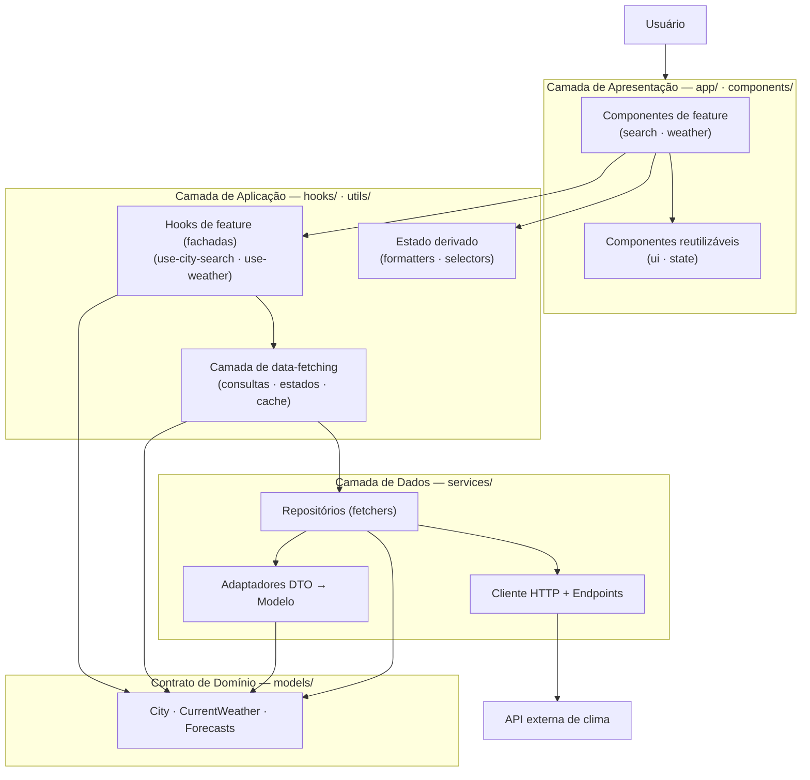

# Arquitetura de Camadas

Representa a arquitetura de camadas funcionais do projeto (apresentação, aplicação, dados e contrato de domínio) e as regras de dependência entre elas, incluindo a integração com a API externa de clima.

