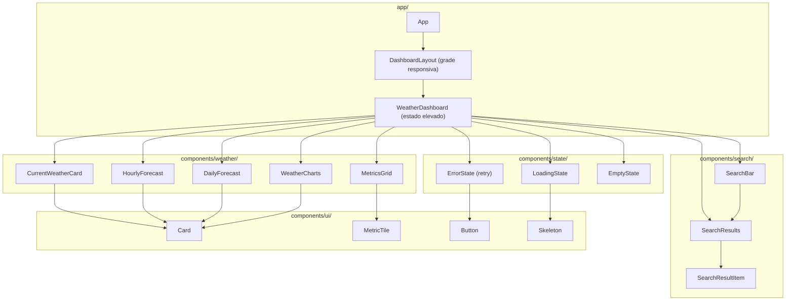

# Componentes

Apresenta os principais componentes da aplicação organizados por pasta (`app/`, `components/search/`, `components/state/`, `components/weather/` e `components/ui/`) e as relações de composição entre eles.

