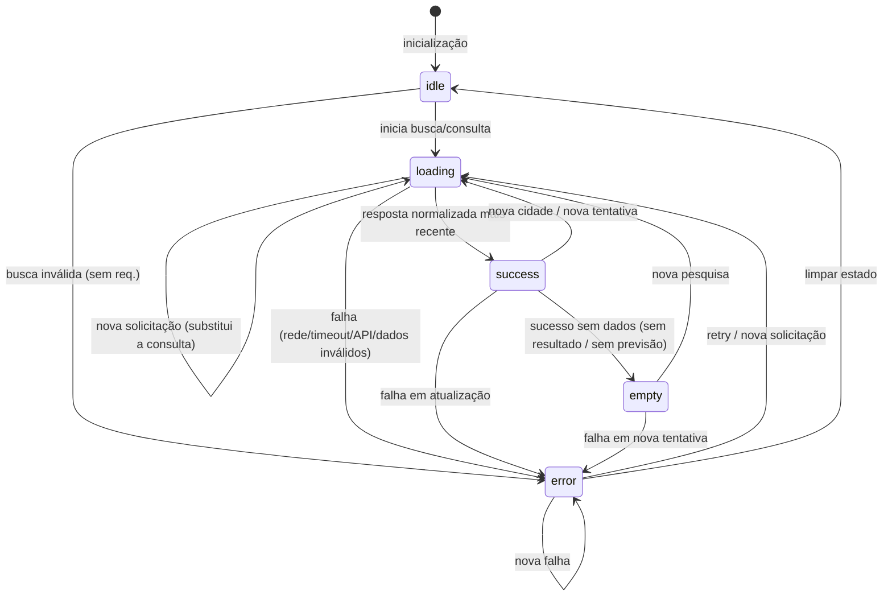

# Estados de Requisição

Representa a máquina de estados de requisição exposta pela camada de data-fetching (`idle`, `loading`, `success`, `error` e `empty`) e as transições possíveis entre eles.

```mermaid
stateDiagram-v2
    [*] --> idle: inicialização

    idle --> loading: inicia busca/consulta
    idle --> error: busca inválida (sem req.)

    loading --> loading: nova solicitação (substitui a consulta)
    loading --> success: resposta normalizada mais recente
    loading --> error: falha (rede/timeout/API/dados inválidos)

    success --> loading: nova cidade / nova tentativa
    success --> empty: sucesso sem dados (sem resultado / sem previsão)
    success --> error: falha em atualização

    empty --> loading: nova pesquisa
    empty --> error: falha em nova tentativa

    error --> loading: retry / nova solicitação
    error --> error: nova falha
    error --> idle: limpar estado
```