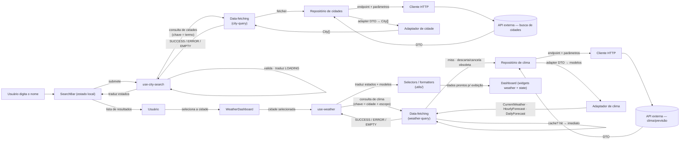

# Fluxo de Dados

Mostra o pipeline completo de dados do dashboard, da busca de cidade pelo usuário até a exibição do clima nos widgets, passando pelas consultas da camada de data-fetching, repositórios, cliente HTTP e adaptadores.

