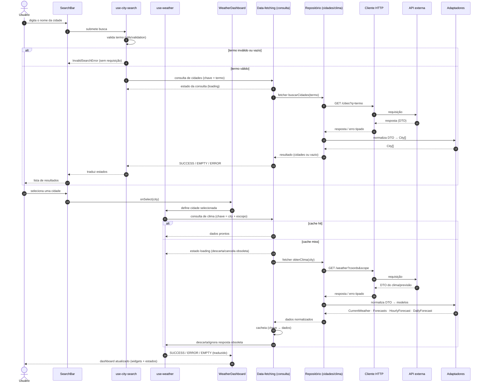

# Sequência — Busca de Cidade

Detalha a interação do fluxo principal: a pesquisa de uma cidade pelo usuário (com validação, consulta e adaptação) e a subsequente seleção da cidade, que dispara a consulta de clima até o dashboard atualizado.

